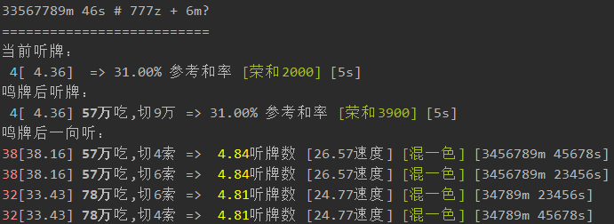

# 日本麻将助手

## 主要功能

- 对战时自动分析手牌，综合进张、打点等，给出推荐舍牌
- 听牌时显示役种和期望打点，一向听和两向听时显示可能的役种
- 有人立直或多副露时，显示各张牌的危险度
- 记录他家手切摸切
- 助手带你看牌谱，推荐每一打的进攻和防守选择（雀魂√ | 天凤开发中）
- 支持四人麻将和三人麻将

详见后面的图文[示例](#示例)

### 支持平台

- 雀魂网页版（[国服](https://www.majsoul.com/1/)√ | [日服](https://game.mahjongsoul.com)√ | [国际服](https://mahjongsoul.game.yo-star.com)√）
- 天凤 [Web 版](http://tenhou.net/3/)

## 导航

- [安装](#安装)
- [使用说明](#使用说明)
- [示例](#示例)
  * [牌效率](#牌效率)
  * [鸣牌判断](#鸣牌判断)
  * [手摸切与安牌显示](#手摸切与安牌显示)
- [牌谱与观战](#牌谱与观战)
- [其他功能说明](#其他功能说明)
- [参与讨论](#参与讨论)

## 安装

分下面几步：

1. 前往 [releases](https://github.com/EndlessCheng/mahjong-helper/releases/latest) 页面下载助手

2. 雀魂需要浏览器允许本地证书。目前仅支持 Chrome 和 360 浏览器等使用了 Chrome 内核的浏览器：
   
   在浏览器中输入 `chrome://flags/#allow-insecure-localhost`，然后点击高亮那一项的「启用」按钮
   
   （不同浏览器/版本的描述可能不一样，如果是英文的话，高亮的是 `Allow invalid certificates for resources loaded from localhost`，把它的 Disabled 改成 Enabled）
   
   之后重启浏览器

3. 安装浏览器扩展 Header Editor（[谷歌商城(需要翻墙)](https://chrome.google.com/webstore/detail/header-editor/eningockdidmgiojffjmkdblpjocbhgh?hl=zh) | [国内](https://www.chromefor.com/header-editor_v4-0-7/)）
   
   （测试发现 Chrome 和 QQ 浏览器无法直接安装 .crx 文件，可以使用 360 浏览器打开 .crx 文件安装此扩展）
   
   安装好扩展后点进该扩展的`管理`界面，点击`导入和导出`，在下载规则中填入 `https://jianyan.me/js/mahjong-helper.json`，点击右侧的下载按钮，然后点击下方的`保存`

安装完成。请重新载入游戏页面。在使用本助手前，建议先看一下本页面下方的[示例](#示例)。

### 从源码安装此助手

您也可以选择从源码安装此助手：

`go get -u -v github.com/EndlessCheng/mahjong-helper/...`

完成后程序生成于 `$GOPATH/bin/` 目录下。


## 使用说明

按照上述流程安装完成后，启动助手，选择平台即可。

需要先启动本助手，再登录网页。

### 注意事项

终端有个小 bug，在使用中若鼠标点击到了空白处，可能会导致终端卡住，此时按下回车键就可以恢复正常。

## 参与讨论

吐槽本项目、日麻技术、麻将算法交流，欢迎加入 QQ 群 [375865038](https://jq.qq.com/?_wv=1027&k=5FyZOgH)


## 示例

### 牌效率

每个切牌选择会显示进张数、向听前进后的进张数、可以做的役种等等信息。

助手会综合每个切牌选择的速度、打点、和率，速度越快，打点和率越高的越靠前。

每个切牌选择以如下格式显示：

```
进张数[改良后的进张数加权均值] 切哪张牌 => 向听前进后的进张数的加权均值 [手牌速度] [期望打点] [役种] [是否振听] [进张牌]
```

例如：


补充说明：

- 无改良时，不显示改良进张数
- 鸣牌时会显示用手上的哪些牌去吃/碰，详见后文
- 防守时，切牌的文字颜色会因这张牌的安全程度而不同，详见后文
- 门清听牌时，会显示立直的期望点数（考虑自摸、一发和里宝）；若默听有役则会额外显示默听的荣和点数
- 存在高低目的场合会显示加权和率的平均点数
- 役种只对较为特殊的进行提示，如三色、一通、七对等。雀魂乱斗之间会有额外的古役提醒
- 若鸣牌且无役会提示 `[无役]`
- 听牌或一向听时根据自家舍牌情况提示振听
- m-万子 p-饼子 s-索子 z-字牌，顺序为东南西北白发中

进张数颜色说明：

- 红色：优秀
- 黄色：普通
- 蓝色：较差

来看看下面几个例子。

**1\. 完全一向听**


标准的完全一向听形状，切 8s。


**2\. 三个复合形的一向听**（选自《麻雀 傑作「何切る」300選》Q106）


单看进张，切 7s 是进张最广的。但是打牌的最终目的是和牌而不是听牌，切 7s 在听牌时可能会有愚型。

一般来说，牺牲一点进张去换取更高的好型听牌率，或者更高的打点是可以接受的。

如下图所示，这里展示了本助手对进张数、好型听牌和打点的综合判断。相比 7s，切 4m 虽然进张数少了四枚，但是能好型听牌，和牌率比 7s 要高，同时还有平和的可能，可以说在保证了速度的同时又兼顾了打点，是最平衡的一打。


**3\. 向听倒退**


这里巡目尚早，相比切 8m，切 1m 虽然向听倒退但是进张面广且有断幺一役，速度是高于 8m 的。

如下图，助手额外给出了向听倒退的建议。（根据进张的不同，可能会形成七对，也可能会形成平和等）


### 鸣牌判断

下图是一个鸣了红中之后，听坎 5s 的例子，宝牌为 6m。

上家打出 6m 宝牌之后考虑是否鸣牌：

这里就可以考虑用 57m 吃，打出 9m，提升打点的同时又能维持听牌。此外，若巡目尚早可以拆掉 46s 追求混一色。



### 手摸切与安牌显示

下图展示了某局中三家的手摸切情况（宝牌为红中和 6s，自家手牌此时为 345678m 569p 45667s）：

- 白色为手切，暗灰色为摸切
- 鸣牌后打出的那张牌会用灰底白字显示，供读牌分析用
- 副露玩家的手切中张牌(3-7)会有不同颜色的高亮，用来辅助判断其听牌率
- 玩家立直或听牌率较高时会额外显示对该玩家的安牌，用 | 分隔，左侧为现物，右侧按照危险度由低到高排序（No Chance 和 One Chance 的安牌作为补充参考显示在后面，简写为 NC 和 OC）
- 下图上家亲家暗杠 2m 后 4p 立直，对家 8s 追立，下家一副露但是手切了很多中张牌，听牌率较高
- 多家立直/副露时会显示综合危险度
- `[n无筋]` 指该玩家的无筋危险牌的剩余种类数。剩余种类数越少，这些无筋牌就越危险。剩余种类数为零表示该玩家是愚型听牌或振听（注：把 1p4p 这种算作一对筋牌，对于四人麻将来说一共有 3\*6=18 对筋牌，三人麻将则为 2\*6=12 对筋牌）


危险度颜色：

- 白色：现物
- 蓝色：<5% 
- 黄色：5~10%
- 红色：10~15%
- 深红：>15%

补充说明：

- 危险度排序是基于巡目、筋牌、No Chance、早外、宝牌、听牌率等数据的综合考虑结果，对于 One Chance 和其他特殊情况并没有考虑，请玩家自行斟酌
- 某些情况下的 No Chance 安牌，本助手是会将其视作现物的（比如 3m 为壁，剩下的 2m 在牌河和自己手里时，2m 是不会放铳的）


## 牌谱与观战

目前助手支持解析雀魂的牌谱（含分享）和观战下的手牌，切换视角也可以解析其他玩家的手牌。


## 其他功能说明

分析何切题时对一副手牌进行分析，可以输入如下命令（mahjong-helper 指的是程序名称，可以修改成自定义的名称）：

- 分析何切
    
    东南西北白发中分别用 1-7z 表示，红 5 万用 0m 表示，红 5 饼用 0p 表示，红 5 索用 0s 表示
    
    `mahjong-helper 34068m 5678p 23567s`
    
    在 `#` 后面添加副露的牌，暗杠用大写表示
    
    `mahjong-helper 234688m 34s # 6666P 234p`
    
- 分析鸣牌
    
    在 `+` 后面添加要鸣的牌，支持用 0 表示的红宝牌
    
    `mahjong-helper 33567789m 46s + 6m`
    
    `mahjong-helper 33567789m 46s + 0s`
    
    `mahjong-helper 24688m 34s # 6666P 234p + 3m`

- 用交互模式分析手牌
    
    `mahjong-helper -i 34568m 5678p 23567s`
    
    输入的切牌、摸牌用简写形式，如 `6m`
    
    [配套小工具](https://github.com/EndlessCheng/mahjong-helper-gui)

- 指出宝牌是哪些（-d 参数，不能有空格）
    
    比如下面的宝牌是 3p 8p 3m 3m
    
    `mahjong-helper -d=38p33m 34568m 5678p 23567s`

- 额外显示打点估计（-s 参数，支持一向听和两向听）
    
    `mahjong-helper -d=38p33m -s 34568m 5678p 23567s`


## 如何获取 WebSocket 收发的消息

1. 打开开发者工具，找到相关 JS 文件，保存到本地。
2. 搜索 `WebSocket`, `socket`，找到 `message`, `onmessage`, `send` 等函数。
3. 修改代码，使用 `XMLHttpRequest` 将收发的消息发送到（在 localhost 开启的）mahjong-helper 服务器，服务器收到消息后会自动进行相关分析。（这一步也可以用油猴脚本来完成）
4. 上传 JS 代码到一个可以公网访问的地方，最简单的方法是传至 GitHub Pages，即个人的 github.io 项目。拿到该 JS 文件地址。
5. 安装浏览器扩展 Header Editor，重定向原 JS 文件地址到上一步中拿到的地址。
6. 允许本地证书通过浏览器，在浏览器（仅限 Chrome 内核）中输入
    
    ```
    chrome://flags/#allow-insecure-localhost
    ```
    
    然后把高亮那一项的 Disabled 改成 Enabled（不同浏览器/版本的描述可能不一样，如果是中文的话点击「启用」按钮）。

7. 重启浏览器。

下面说明天凤和雀魂的代码注入点。

### 天凤 (tenhou)

1. 搜索 `WebSocket`，找到下方 `message` 对应的函数，该函数中的 `a.data` 就是 WebSocket 收到的 JSON 数据。
2. 在该函数开头（或末尾）添加如下代码：

    ```javascript
    var req = new XMLHttpRequest();
    req.open("POST", "http://localhost:12121/");
    req.send(a.data);
    ```

### 雀魂 (majsoul)

雀魂收发的消息是 protobuf，接收的消息一部分为含有类型的通知消息，另一部分为不含有类型的请求响应消息，
对于后者需要获取雀魂发送的消息以获得响应消息类型。

也就是说需要将雀魂发送和接收的消息都发给 mahjong-helper 服务器。

类似天凤，搜索 `WebSocket` 找到下方的 `_socket.onmessage` 和 `_socket.send`，添加代码。

服务器收到消息后，可以基于 [liqi.json](https://github.com/EndlessCheng/mahjong-helper/blob/master/platform/majsoul/proto/lq/liqi.json) 文件解析雀魂的 protobuf 数据。

[record.go](https://github.com/EndlessCheng/mahjong-helper/blob/master/platform/majsoul/record.go) 展示了使用 WebSocket 登录和下载牌谱的例子。

考虑到还有观看牌谱这种获取前端 UI 事件的情况，还需修改额外的代码。在网页控制台输入 `GameMgr._inRelease = 0`，开启调试模式，通过雀魂已有的日志可以看到相关代码在哪。具体修改了哪些内容可以对比雀魂的 code.js 和我修改后的 [code.js](https://jianyan.me/majsoul/code-v0.1.4.js)。


## License

This project is licensed under the MIT License - see the [LICENSE](LICENSE) file for details.
